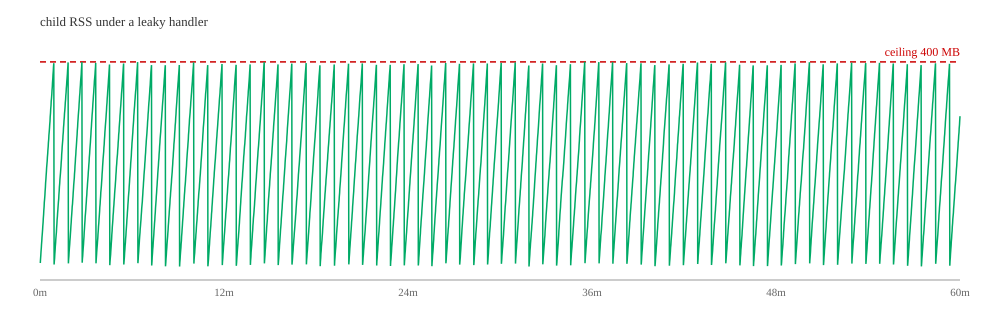

# tarsk

A Python task queue whose workers hold a memory ceiling you set — without losing a task.

`task` with `rust` through the middle. The scheduler, retry state machine, lease tracking and
child supervision are Rust; the only Python in the hot path is your handler.

> **Status: 0.1.0, not yet on PyPI.** The core works and is tested; the wheel builds and
> installs. See [What is missing](#what-is-missing).

**📖 [Documentation](https://rahmadafandi.github.io/tarsk/)** — everything below the fold lives
there: [how it works](https://rahmadafandi.github.io/tarsk/how-it-works),
[writing tasks](https://rahmadafandi.github.io/tarsk/tasks),
[routing and scheduling](https://rahmadafandi.github.io/tarsk/routing),
[operating](https://rahmadafandi.github.io/tarsk/operating),
[benchmarks](https://rahmadafandi.github.io/tarsk/benchmarks).

```python
from tarsk import App

app = App(broker="redis://localhost:6379/0")

@app.task(retries=3, timeout=30, queue="heavy")
def embed_document(doc_id: str) -> dict:
    ...

task_id = embed_document.send("abc")
```

```bash
tarsk worker --app myapp:app --broker redis://localhost:6379/0 \
             --queues heavy --children 4 --max-rss 400MB --metrics 0.0.0.0:9090
```

**Handlers must be idempotent.** Delivery is at-least-once. This is a contract, not a footnote:
a worker killed mid-task will run that task again.

## What it does that others do not



One hour, 72,001 tasks, a handler that never frees anything. 66 recycles, peak 400 MB against a
400 MB ceiling, no sample over it, nothing killed, nothing lost. The flat line beneath the
sawtooth, on the same axis, is the supervisor doing the holding: 28.32 to 28.40 MB across the
hour, a drift of 82 KB. A ceiling enforced from inside a process with the same problem would
only defer it.

Every Python task queue leaks, because leaks come from the code they run rather than from the
queue. The difference is what the runtime does about it.

`--max-rss` is a byte budget. Celery's `--max-tasks-per-child` is a task count, which only
bounds bytes if you already know how many bytes a task costs — and stays wrong once that
changes. Same configuration, different workloads:

| | leak 20MB/task | leak 40MB/task | payload-dependent 2–80MB |
|---|---|---|---|
| celery `--max-tasks-per-child=6` | **162 MB** | 282 MB | 327 MB |
| tarsk `--max-rss=200MB` | 183 MB | **183 MB** | **187 MB** |

Celery wins the first column, and that is the honest result: when the leak per task is known
and constant, dividing the budget by it works — someone divided 200 by 20 and typed 6. It is
the other two columns tarsk was built for: nothing was reconfigured between them, the workload
moved, and the guess encoded in that 6 went with it.

The worker that runs your code is 27 MB against Celery's 41 MB and taskiq's 44 MB, because it
imports your tasks and nothing else — no broker driver, no scheduler. Recycling costs 7 ms at
the 99th percentile against Celery's 139 ms, because the replacement child starts before the
trigger fires and the slot never goes empty.

## What it does not claim

**Not faster.** With a 50 ms handler tarsk, Celery and taskiq all reach 19–20 tasks/s. Draining
10,000 no-op tasks across four processes: Celery 10.0s, taskiq 2.3s, tarsk 2.2s — ahead in every
run and by 4%, which this project's own benchmark rules call a tie. It starts in half the time
and runs in half the memory; that is the claim, and speed is not.

This file claimed a 1.45× lead until the numbers were checked on more than one machine. The full
retraction, and every column where tarsk loses, is in
[the benchmarks](https://rahmadafandi.github.io/tarsk/benchmarks).

**Not a hard ceiling regardless of task size.** The ceiling is read while a child is idle, so a
child never *starts* a task it cannot afford — but a handler that allocates 300 MB will allocate
it. Overshoot is bounded by one task's peak, not by zero.

**Not durable execution.** That is Temporal's category, and it is much heavier.

## What is missing

- Not on PyPI yet — the wheel builds and installs, it just has not been uploaded
- No chord. `chain` and `group` are here; fanning back in to a callback is not
- Windows runs the suites that need no broker, since neither Redis nor Postgres ships for it.
  Everything else — the channel, recycling, the memory ceiling — is tested there

## Running the tests

The toolchain is pinned in [`mise.toml`](mise.toml) — Rust 1.94.0 and Python 3.14.3, the
versions the published numbers were produced with. With [mise](https://mise.jdx.dev) installed,
`mise install` fetches both and entering the directory creates `.venv` from the pinned Python.
Without it, any Python 3.11+ and a recent stable Rust will build: the wheel is abi3-py311.

```bash
python -m venv .venv && .venv/bin/pip install maturin msgpack
.venv/bin/maturin develop --release

.venv/bin/python tests/test_ipc.py       # protocol, timeouts, retries
.venv/bin/python tests/test_recycle.py   # the ceiling, soft timeouts, middleware
.venv/bin/python tests/test_brokers.py   # Redis and Postgres end to end
cargo test --lib                         # cron, console, socket permissions
```

The broker tests start their own `redis-server` and Postgres cluster and skip whichever is not
installed. `python demo/run.py --minutes 1 --ceiling 150MB --rate 30` is the definition of done
in miniature: it exits non-zero if a task goes missing or the supervisor drifts.

## License

MIT — see [LICENSE](LICENSE).
